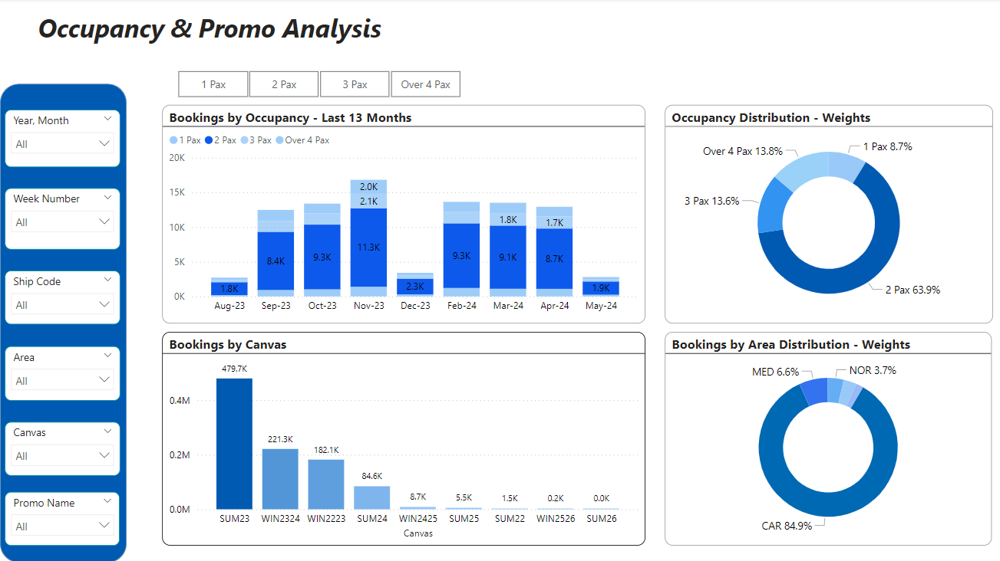
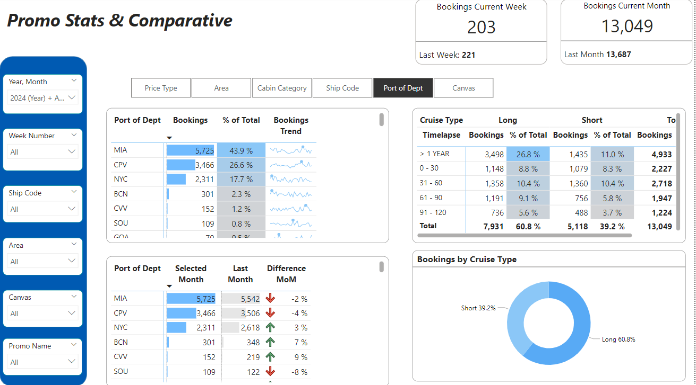

# Occupancy Metrics Dashboard
# Shipping Company Semantic Model Documentation

## Overview

This repository holds the semantic model and documentation for a fictional U.S. shipping company. The goal of the model is to bring together web session data, booking records, and vessel occupancy information into a unified analytical framework. Data is sourced from:

* **Google Analytics** (sessions, users, site searches)
* **SAP BusinessObjects (BO)** (booking and production details)
* **Excel files** (daily production logs)

Using Power BI, we created a semantic layer that organizes these disparate sources into a coherent data structure, enabling interactive reporting of key performance indicators (KPIs).

---

## Business Context

The shipping company seeks to understand how online engagement (web sessions and site searches) translates into actual bookings and vessel occupancy. By analyzing:

1. **Web traffic** (sessions, new users, bounce rate)
2. **Search behavior** (keywords and site searches)
3. **Booking activity** (number of bookings, passenger counts)
4. **Production/occupancy** (actual sailings and capacity usage)

stakeholders can make data‑driven decisions on marketing effectiveness, pricing strategies, and operational planning.

---

## Data Sources and Tables

The semantic model includes the following tables:

| Table Name                 | Description                                             |
| -------------------------- | ------------------------------------------------------- |
| **Calendar**               | Date dimension (year, month, week, custom periods)      |
| **Hours**                  | Hour-of-day dimension for time-based analysis           |
| **GA\_Sessions**           | Website sessions, bounces, average session duration     |
| **GA\_Users**              | Unique and new users by date and hour                   |
| **GA\_Bookings**           | Transactions recorded in Google Analytics               |
| **GA\_Site\_Search**       | Search terms and refined keywords used on the site      |
| **WIZ\_Daily\_Production** | Daily visit counts from Excel production logs           |
| **BO\_Production**         | SAP BO booking data: booking ID, dates, passenger count |
| **Page**                   | Page-level data imported from site logs                 |
| **Page\_Category**         | Categorized page views and traffic metrics              |
| **Price Catalogue**        | Price descriptions and catalog details                  |

Each table has been documented in the **Data Dictionary.xlsx** file included in this repo.

---

## Semantic Relationships

To create a unified model, we defined one‑to‑many relationships from our dimensions (Calendar, Hours) into each fact table. For example:

* **Calendar\[Date] → BO\_Production\[Booking Date]**
* **Calendar\[Date] → GA\_Sessions\[Date]**
* **Hours\[Hour] → GA\_Users\[Hour]**

This structure allows any time‑based filter (e.g., selecting a specific week or hour) to propagate to all measures across the report.

---

## Key Measures and Calculations

The following DAX measures were created to surface critical insights:

| Measure Name               | Purpose                                                           |
| -------------------------- | ----------------------------------------------------------------- |
| **Total Bookings**         | Counts total booking records (`COUNT(BO_Production[Booking ID])`) |
| **Bookings Last Week**     | Bookings in the previous 7‑day period                             |
| **Bookings Previous Week** | Bookings in the 7 days prior to last week                         |
| **Bookings Difference**    | Week‑over‑week change (`Bookings Last Week – Prev Week`)          |
| **Bookings by Pax**        | Counts bookings by passenger count (1 Pax, 2 Pax, etc.)           |
| **Total Sessions**         | Sum of web sessions plus daily visits                             |
| **Occupancy Rate**         | Ratio of actual sailings versus capacity                          |
| **Weighted Bookings**      | Applies a weight factor by passenger category                     |

*All DAX expressions are detailed in the Data Dictionary under the “Expression” column for each measure.*

---

## Analytical Scenario & Solution

**Situation:** Marketing teams noticed fluctuations in web traffic but lacked a clear view of how sessions translated into bookings. Operations managers needed accurate occupancy forecasts to optimize vessel utilization.

**Solution Approach:**

1. **Integrate** web analytics and booking systems into a single semantic model.
2. **Define** time intelligence measures to compare week‑over‑week and month‑over‑month trends.
3. **Calculate** occupancy rates and segment bookings by passenger count.
4. **Visualize** KPIs in Power BI, enabling interactive exploration of date ranges, search behavior, and booking performance.

Stakeholders can now:

* Track conversion rates from sessions to bookings in real time.
* Identify peak search terms that drive bookings.
* Monitor occupancy to adjust pricing and marketing spend.

---

---

---

## Accessing the Report

View the interactive report on Power BI:

https://app.powerbi.com/view?r=eyJrIjoiN2ZhMmVlZDItN2UyMi00OGEyLTlmY2UtOWY1MDk1NDMyZTk5IiwidCI6ImRmODY3OWNkLWE4MGUtNDVkOC05OWFjLWM4M2VkN2ZmOTVhMCJ9

---

# Key Insights
---

## 1. Web Analytics

- **Total Sessions:** ~120 000 sessions over the period  
- **New Users:** ~30 000 (25 % of all visitors)  
- **Average Session Duration:** 4 m 30 s  
- **Bounce Rate:** 45 % (down 5 pp vs. prior period)  
- **Top Site Searches:**  
  1. “Caribbean cruise” (15 % of all searches)  
  2. “Family cabin” (10 %)  
  3. “All-inclusive” (8 %)  

> **Insight:** Improved engagement (longer sessions, lower bounce) has driven a higher proportion of visitors to advanced search—and ultimately bookings.

---

## 2. Booking Metrics

- **Total Bookings:** 12 000 reservations  
- **Conversion Rate:** 10 % of sessions → booking confirmation  
- **Week-over-Week Growth:** +5 % bookings  
- **Booking Distribution by Route (“World”):**  
  - Caribbean: 40 %  
  - Mediterranean: 25 %  
  - Northern Europe: 15 %  
  - Alaska: 10 %  
  - Others: 10 %  

> **Insight:** Caribbean routes lead volume but Mediterranean shows the fastest growth (+8 % WoW).

---

## 3. Vessel Occupancy

- **Average Occupancy:** 88 % of available berths filled  
- **Peak Occupancy Days:**  
  - Fridays & Saturdays: 95 %  
  - Tuesdays & Wednesdays: 82 %  
- **Under-utilized Voyages:** Northern Europe at 75 % occupancy  

> **Insight:** Weekend sailings are near capacity; midweek voyages present an opportunity for targeted promotions to smooth demand.

